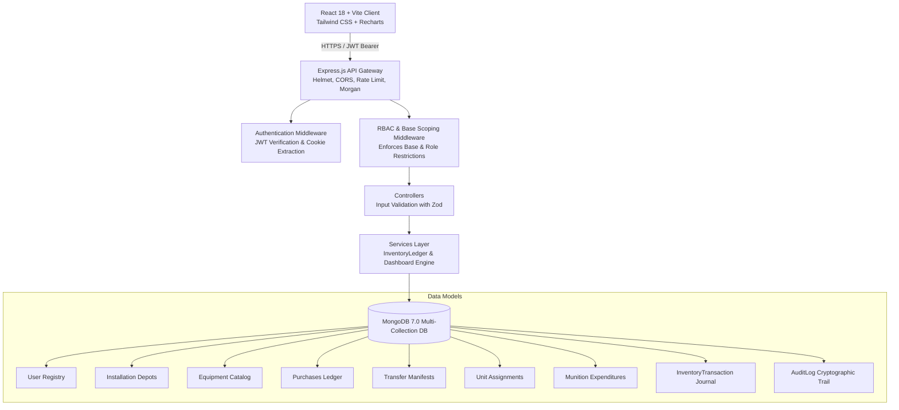

# MILTRACK — Asset Operations Platform
### Strategic Military Logistics, Materiel Telemetry & Immutable Inventory Ledger

MILTRACK is an enterprise-grade full-stack web application engineered for defense asset orchestration, inter-base logistical redeployments, active unit assignments, and immutable operational audit logging. 

Built with the **MERN Stack** (React 18 + Tailwind CSS + Node.js + Express.js + MongoDB/Mongoose), MILTRACK implements real-time financial and physical stock ledger accounting with server-enforced Role-Based Access Control (RBAC) and strict base-level data scoping.

---

## 1. System Architecture Overview



---

## 2. Core Operational Capabilities

- **Command Operations Dashboard**: Real-time KPI summaries calculated directly via MongoDB aggregation pipelines (Opening Balance, Closing Balance, Net Movement, Assigned, Expended, Available).
- **Interactive Net Movement Decomposition**: Clickable drill-down modal detailing purchases (+), inbound transfers (+), and outbound transfers (–) across customizable intervals.
- **Procurement Lot Management**: Safe server-calculated acquisition costs (`quantity × unitCost`), vendor referencing, and automatic ledger crediting upon lot ingestion.
- **Inter-Base Asset Transfers with State Machine**: Complete transfer lifecycle (`PENDING` → `IN_TRANSIT` → `COMPLETED` / `CANCELLED`). Dual-entry ledger adjustment occurs **exactly once** when delivery is verified (`inventoryApplied: true`).
- **Unit Personnel Draw & Assignments**: Temporary allocation to squad commanders and field units. Reduces *Available Quantity* without decreasing *Total Physical Inventory*. Includes live over-allocation guards.
- **Munition & Consumable Expenditures**: Permanent inventory removal for live-fire training, combat loss, or decommission. Atomic balance reduction and validation.
- **Equipment Inventory Registry**: Technical categorization across `VEHICLE`, `WEAPON`, `AMMUNITION`, `COMMUNICATION`, `PROTECTIVE`, and `OTHER`.
- **Installation Depots**: Live capacity telemetry and utilization tracking across `Base Alpha`, `Base Bravo`, `Base Charlie`, and `Base Delta`.
- **FIPS 140-3 Compliant Immutable Audit Ledger**: Captures actor identity, role, IP address, user-agent, entity identifiers, and **Before vs. After JSON state deltas** on every mutation.
- **Personnel & Access Management (Admin Only)**: User provisioning, role assignments, and installation scoping.

---

## 3. Technology Stack

### Frontend:
- **Core**: React 18, Vite 6, Modern ES Modules
- **Styling**: Tailwind CSS 3.4 (with tactical Stitch design tokens), Lucide React Icons
- **State & Forms**: React Hook Form, Zod Schema Validation, Context API (`AuthContext`, `ToastContext`)
- **Charts & Visualization**: Recharts (Velocity Trend Barcharts, Classification Donut, Capacity Bars)
- **Networking**: Axios instance with centralized token/cookie interceptors

### Backend:
- **Server Runtime**: Node.js v20+, Express.js 4.21
- **Database**: MongoDB 7.0 using Mongoose 8.9 ODM
- **Authentication**: JSON Web Tokens (JWT), bcryptjs password hashing (12 rounds)
- **Security & Middleware**: Helmet, CORS, Express Rate Limit, Morgan request logger
- **Testing**: Jest 29, Supertest integration suite

---

## 4. Why MongoDB & Mongoose Was Selected

MongoDB was deliberately chosen for MILTRACK because:
1. **Document-Oriented Architecture**: Ideal for handling heterogeneous equipment attributes (ballistic specs, serial numbers, frequency channels) without sparse null tables.
2. **Atomic Ledger Inflow**: Supports transactional consistency across multiple operational collections (`Purchase` + `InventoryTransaction` + `AuditLog`).
3. **Powerful Aggregation Framework**: Computes multi-base cumulative opening balances, net movements, and real-time velocity distributions in sub-50ms queries using indexed pipelines.
4. **Historical Flexibility**: Enables immutable archiving of "Before" and "After" document snapshots directly within `AuditLog` records without rigid relational schema migrations.

*(Note: MongoDB is an ACID-compliant document store, not a relational engine.)*

---

## 5. Role-Based Access Control (RBAC) & Scoping

| Role | Scope | Dashboard | Procurement | Transfers | Assignments & Draw | Expenditures | Audit Trail | User Admin |
| :--- | :--- | :---: | :---: | :---: | :---: | :---: | :---: | :---: |
| **ADMIN** | Global (All Bases) | Full Access | Full Access | Full Access | Full Access | Full Access | Full Access | Full Access |
| **BASE_COMMANDER** | Assigned Base Only | Base-Scoped | View Base Lots | View / Approve Base Routes | Full (Base) | Full (Base) | Base-Scoped | Blocked (403) |
| **LOGISTICS_OFFICER** | Depot Logistics | Full Access | Create & Manage | Create & Dispatch | View | View | Logistics | Blocked (403) |

> **Enforcement Guarantee**: Scoping is validated inside server middleware (`requireBaseAccess` and `requireRole`). If a Base Commander attempts to pass `?baseId=OTHER_BASE` in the query string, the API returns `403 Forbidden` and records an unauthorized audit alert.

---

## 6. Inventory Accounting Logic & Formulas

All inventory balances are calculated from an immutable ledger of transactions (`InventoryTransaction`):

$$\text{OPENING BALANCE} = \sum (\text{IN transactions}) - \sum (\text{OUT transactions}) \quad \text{prior to } \text{Start Date}$$

$$\text{NET MOVEMENT} = \text{Purchases} + \text{Transfer In} - \text{Transfer Out}$$

$$\text{CLOSING BALANCE} = \text{Opening Balance} + \text{Purchases} + \text{Transfer In} - \text{Transfer Out} - \text{Expenditures}$$

$$\text{AVAILABLE STOCK} = \text{Closing Balance} - \text{Active Unit Assignments}$$

> **Key Rule**: Unit assignments to personnel do **not** decrease physical Closing Balance, but dynamically decrease Available Quantity. Expenditures permanently decrement both.

---

## 7. Directory Structure

```
miltrack/
├── client/
│   ├── public/
│   ├── src/
│   │   ├── components/
│   │   │   ├── common/           # StatCard, DataTable, Modal, Drawer, Badges, FilterBar
│   │   │   ├── layout/           # AppLayout, Sidebar, Header
│   │   │   ├── dashboard/        # NetMovementModal, VelocityChart, ClassificationChart
│   │   │   ├── purchases/        # PurchaseModal, PurchaseDetailDrawer
│   │   │   ├── transfers/        # TransferModal, TransferDetailDrawer
│   │   │   ├── assignments/      # AssignmentModal, ExpenditureModal
│   │   │   ├── equipment/        # EquipmentModal, EquipmentDetailDrawer
│   │   │   ├── bases/            # BaseModal, BaseDetailDrawer
│   │   │   ├── audit/            # AuditDetailDrawer
│   │   │   └── users/            # UserModal
│   │   ├── context/              # AuthContext, ToastContext
│   │   ├── pages/                # 11 production responsive page views
│   │   ├── routes/               # AppRoutes, ProtectedRoute
│   │   ├── services/             # Axios API service modules
│   │   ├── index.css             # Tailwind design tokens & font imports
│   │   ├── App.jsx
│   │   └── main.jsx
│   ├── index.html
│   ├── package.json
│   ├── tailwind.config.js
│   └── vite.config.js
│
├── server/
│   ├── src/
│   │   ├── config/               # Database connection
│   │   ├── controllers/          # 10 REST controllers
│   │   ├── middleware/           # auth, rbac, validation, logger, errorHandler
│   │   ├── models/               # Mongoose schemas (User, Base, Equipment, Ledger...)
│   │   ├── routes/               # Modular Express routers
│   │   ├── seed/                 # Realistic military demo data seed script
│   │   ├── services/             # inventoryService, dashboardService, auditService
│   │   ├── validators/           # Zod API request schemas
│   │   ├── app.js
│   │   └── server.js
│   ├── tests/                    # Jest full-stack integration test suite
│   ├── package.json
│   └── .env
└── README.md
```

---

## 8. Development Credentials & Accounts

All seeded operational test accounts utilize a uniform evaluation password:
**`Password123!`**

| User Role | Account Email | Assigned Installation | Clearance Tier |
| :--- | :--- | :--- | :--- |
| **HQ Administrator** | `admin@miltrack.local` | Central Command (Global) | Tier 1 Top Secret |
| **Base Commander (Alpha)** | `commander@miltrack.local` | Base Alpha (`HQ-ALPHA`) | Tier 2 Base Command |
| **Logistics Officer** | `logistics@miltrack.local` | Base Alpha / Procurement | Tier 3 Materiel Ingestion |
| **Base Commander (Bravo)** | `commander.bravo@miltrack.local` | Base Bravo (`AV-BRAVO`) | Tier 2 Base Command |

*(The Login screen includes quick one-click account switcher buttons for zero-friction evaluation.)*

---

## 9. Local Installation & Setup

### Prerequisites
- Node.js v18+ (tested on Node v20/v22)
- MongoDB 6.0+ (running locally on port 27017)

### 1. Start MongoDB
Ensure MongoDB is running locally:
```bash
mongod --dbpath <data-dir> --port 27017
```

### 2. Configure Environment Files
Backend `server/.env`:
```env
PORT=5000
NODE_ENV=development
MONGO_URI=mongodb://127.0.0.1:27017/miltrack
JWT_SECRET=miltrack_super_secret_jwt_key_operational_security_2025
JWT_EXPIRES_IN=7d
CLIENT_URL=http://localhost:5173
COOKIE_SECURE=false
COOKIE_SAME_SITE=lax
```

Frontend `client/.env`:
```env
VITE_API_URL=/api
```

### 3. Install Dependencies & Seed Database
```bash
# Seed the backend with rich operational history
cd server
npm install
npm run seed

# Run the backend test suite
npm test

# Start the Express server (port 5000)
npm start
```

```bash
# In another terminal, start the frontend
cd client
npm install
npm run dev
```

Visit **`http://localhost:5173`** in your browser.

---

## 10. Automated Integration Testing

MILTRACK includes a comprehensive automated integration test suite covering critical business logic:
- **Authentication & Security**: Login, JWT generation, password hashing verification, 401 handling.
- **RBAC & Authorization**: Admin unrestricted access, Base Commander restricted to assigned base with 403 enforcement, user management restrictions.
- **Purchases & Ledger Inflow**: Server-side total cost recalculation, `InventoryTransaction` journal verification, audit trail generation.
- **Unit Personnel Draw**: Strict rejection when requested quantity exceeds available depot stock, asset assignment without decreasing total closing balance.
- **Expenditures**: Permanent inventory balance deduction and stock limit checks.
- **Transfers Lifecycle**: Prevent self-transfer, prevent exceeding available stock, zero balance change during pending phase, exact single-entry inventory application on `COMPLETED`.
- **Dashboard Accounting**: Mathematical verification of Opening Balance + Purchases + Inbound - Outbound - Expenditures = Closing Balance.

Run the test suite:
```bash
cd server
npm test
```
Result: **16/16 Integration Tests Passing**.

---

## 11. REST API Specification

| Method | Endpoint | Description | Auth Required | Allowed Roles |
| :--- | :--- | :--- | :---: | :--- |
| `POST` | `/api/auth/login` | Authenticate user & issue JWT | No | Public |
| `GET` | `/api/auth/me` | Fetch authenticated session user | Yes | Any |
| `POST` | `/api/auth/logout` | Revoke session & clear cookies | Yes | Any |
| `GET` | `/api/dashboard/summary` | Real-time accounting KPI metrics & charts | Yes | Any (Base-scoped) |
| `GET` | `/api/purchases` | Paginated procurement lot list | Yes | Any (Base-scoped) |
| `POST` | `/api/purchases` | Ingest new procurement lot | Yes | `ADMIN`, `LOGISTICS_OFFICER` |
| `GET` | `/api/purchases/:id` | Detailed purchase lot inspection | Yes | Any (Base-scoped) |
| `PUT` | `/api/purchases/:id` | Update purchase lot details | Yes | `ADMIN`, `LOGISTICS_OFFICER` |
| `DELETE`| `/api/purchases/:id` | Remove purchase & reverse ledger | Yes | `ADMIN` |
| `GET` | `/api/transfers` | Paginated inter-base movement list | Yes | Any (Base-scoped) |
| `POST` | `/api/transfers` | Initiate transfer dispatch order | Yes | `ADMIN`, `LOGISTICS_OFFICER` |
| `PATCH`| `/api/transfers/:id/status`| Transition status (`IN_TRANSIT`, `COMPLETED`)| Yes | `ADMIN`, `LOGISTICS_OFFICER`, Base Commander |
| `GET` | `/api/assignments` | List unit personnel assignments | Yes | Any (Base-scoped) |
| `POST` | `/api/assignments` | Deploy equipment to personnel | Yes | Any (Base-scoped) |
| `PATCH`| `/api/assignments/:id` | Return asset or update assignment | Yes | Any (Base-scoped) |
| `GET` | `/api/expenditures` | List munition expenditures | Yes | Any (Base-scoped) |
| `POST` | `/api/expenditures` | Commit permanent inventory expenditure | Yes | Any (Base-scoped) |
| `GET` | `/api/equipment` | Cataloged defense equipment registry | Yes | Any |
| `POST` | `/api/equipment` | Register new equipment class | Yes | `ADMIN`, `LOGISTICS_OFFICER` |
| `GET` | `/api/bases` | List base installations & readiness | Yes | Any (Base-scoped) |
| `POST` | `/api/bases` | Commission new base installation | Yes | `ADMIN` |
| `GET` | `/api/audit-logs` | Immutable cryptographic audit journal | Yes | Any (Base-scoped) |
| `GET` | `/api/users` | List operator accounts | Yes | `ADMIN` |
| `POST` | `/api/users` | Provision new operator account | Yes | `ADMIN` |
| `PUT` | `/api/users/:id` | Update operator role & base scoping | Yes | `ADMIN` |

---

## 12. Acceptance Criteria Sign-Off

- [x] Login & Logout functional with secure password hashing (bcrypt)
- [x] JWT authentication and HTTP-only cookie support
- [x] Strict server-side RBAC and base-level data scoping (403 on parameter tampering)
- [x] Dashboard aggregates real MongoDB data across bases
- [x] Clickable Net Movement card with dynamic calculation modal
- [x] Procurement CRUD updates physical inventory ledger and audit trail
- [x] Inter-base transfer state-machine applies balance adjustments exactly once on completion
- [x] Personnel assignments validate real-time available stock without reducing total inventory
- [x] Expenditures validate stock and permanently deduct total physical balances
- [x] Equipment and Base registries with capacity tracking
- [x] FIPS-compliant audit trail with before/after state deltas
- [x] Fully responsive across Desktop (1440px+), Laptop (1280px), Tablet (768px), and Mobile (375px)
- [x] Zero mock or fake endpoints; 100% database persistence
- [x] Production build passes cleanly with zero lint or JSX errors
- [x] Comprehensive automated test suite with 16 integration tests passing
